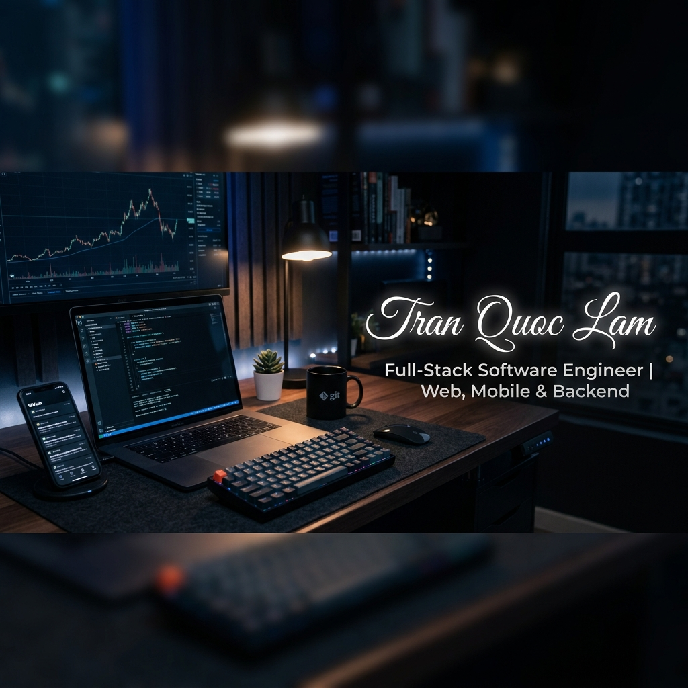

  <!-- Top Workspace Header Banner -->
  

    

  <!-- Green Neon Animated Typing Tagline -->
  

    

  <!-- Main Welcome Heading -->
  <h1>Hi, I'm Tran Quoc Lam 👋</h1>

  <!-- Subtitle -->
  <h3>Software Engineer | Web, Mobile & Backend Developer</h3>

  <!-- Brief Intro Summary -->
  

    I build production-ready web applications, scalable backend services, real-time messaging systems, and cross-platform mobile apps.
  

   

  <!-- Animated Tech Typing SVG -->
  

    

  <!-- Quick Badges & Profile Views -->
  

    
    &nbsp;
    
  

 

---

## 🙋‍♂️ About Me

I am a **Full-Stack Software Engineer** specializing in building modern **Web, Mobile, and Backend** applications using **TypeScript, React, Next.js, NestJS, React Native, and Flutter**.

My experience includes:

- **Web & Mobile Development:** Building responsive web apps with React & Next.js, and cross-platform mobile apps with React Native and Flutter.
- **Backend & APIs:** Designing robust backend services, scalable architectures, and REST APIs with NestJS and TypeScript.
- **Real-Time Systems:** Developing high-performance real-time messaging and communication systems with WebSocket and Socket.IO.
- **Search & Streaming:** Integrating search features with Elasticsearch and building live streaming / real-time response handling.
- **DevOps & Deployment:** Containerizing and deploying applications efficiently using Docker.
- **Product Delivery:** Supporting products through the full development lifecycle from concept to production.

I am currently focused on **Full-Stack (Web & Mobile)** and **Backend Software Engineer** opportunities.

---

## 🛠️ Languages & Technologies

### Languages & Frameworks

 

- **Languages:** TypeScript, JavaScript (ES6+)
- **Front-End & Mobile:** React, Next.js, React Native, Flutter
- **Back-End:** NestJS, Express.js, WebSocket, Socket.IO
- **Database & Search:** Elasticsearch, MongoDB / PostgreSQL
- **DevOps & Tools:** Docker, Git, GitHub, VS Code

---

## 📊 GitHub Stats

  
  

 

  

